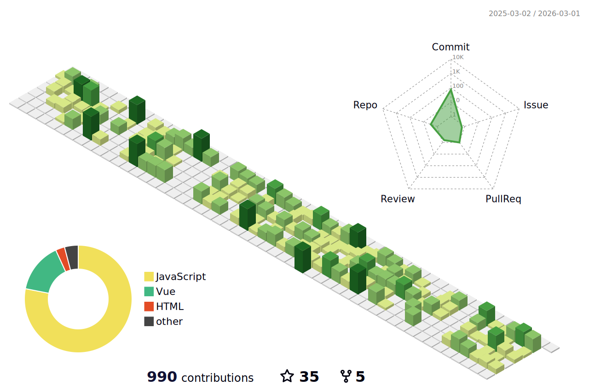

<h1 align="center">Olá 👋, Eu sou Jackson Dhanyel Santin</h1>
<h3 align="center">Brasileiro, apaixonado por tecnologia e novas linguagens de programação</h3>

###

  
  | 💻 Minhas stacks                                                                                              | 🛠 No momento estou aprendendo                                                                               |
  | -------------------------------------------------------------------------------------------------------------- | ------------------------------------------------------------------------------------------------------------ |
  |                |      |
  |            |              |
  |              | |
  |         |                |
  |           |
  |    |
  |  |
  |      |
  

###

- 👨‍💻 Atualmente estou trabalhando na CGI Software, atuando como programador front-end da empresa

- 💬 Sobre mim: Curto tecnologias, jogos e seriados

- 👨‍💻 Todos os meus projetos estão disponíveis aqui no [Github](https://github.com/JacksonSantin?tab=repositories)
- 🔗 Veja mais sobre mim em [Curriculum Vitae - Jackson Dhanyel Santin](https://curriculum-vitae-jacksonsantin.vercel.app)
- 🔗 Me acompanhe no [DEV Community](https://dev.to/jacksonsantin)

## Status

  
 
 
  <code></code>
  <code></code>
  <code></code>
  <code></code>
  <code></code>
  <code></code>
  <code></code>
  <code></code>
  <code></code>
  <code></code>
   <code></code>

 
  
  ##
  
  
 
  
 	
   
  
   
   
  

