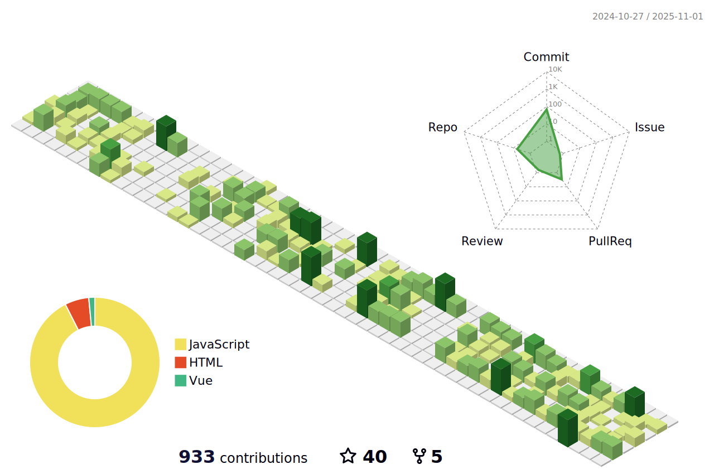

<h1 align="center">Olá 👋, Eu sou Jackson Dhanyel Santin</h1>
<h3 align="center">Brasileiro, apaixonado por tecnologia e novas linguagens de programação</h3>

- 🛠 No momento estou aprendendo **Node.JS**, **ES6** e **Typescript**

- 💻 Minhas stacks: **PHP, HTML, CSS, JAVA, VUE, REACT, REACT NATIVE, VueJS, JS**

- 👨‍💻 Atualmente estou trabalhando na CGI Software, atuando como programador front-end da empresa

- 💬 Sobre mim: Curto tecnologias, jogos e seriados na Netflix e Amazon Prime

- 👨‍💻 Todos os meus projetos estão disponíveis no [https://github.com/JacksonSantin](https://github.com/JacksonSantin)

- 🔗 Veja mais sobre mim em [https://jdssistemas.com](https://jdssistemas.com)

## Status

  
 
 
  
  
  
  
  
  
  
  
  

 
  
  ##
  
  
 
  
 	
  
  
   
     
 

